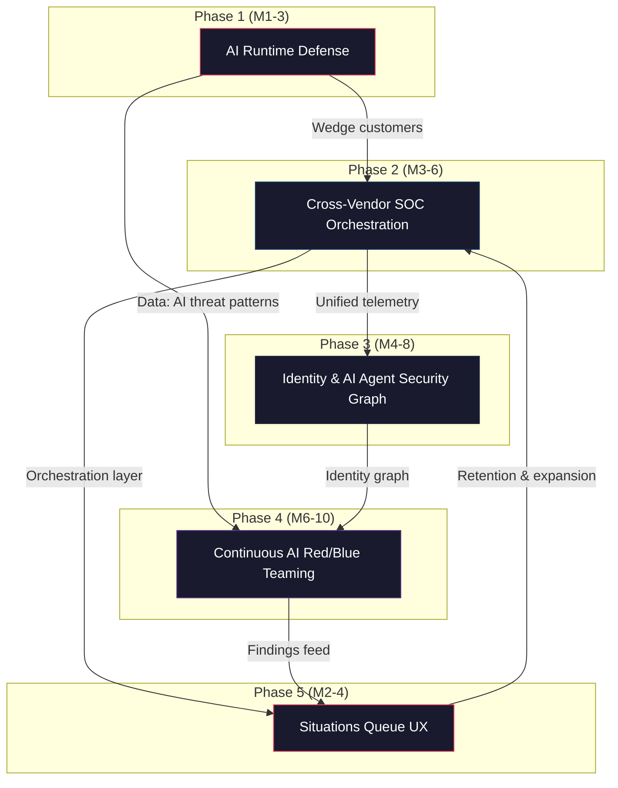
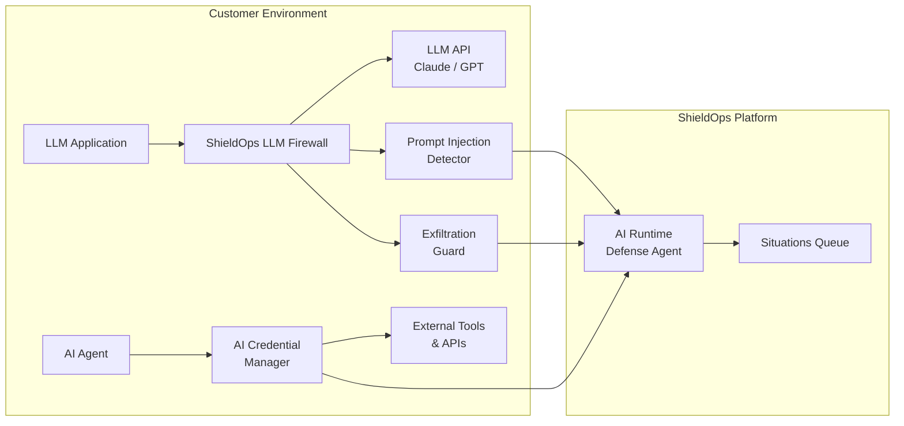
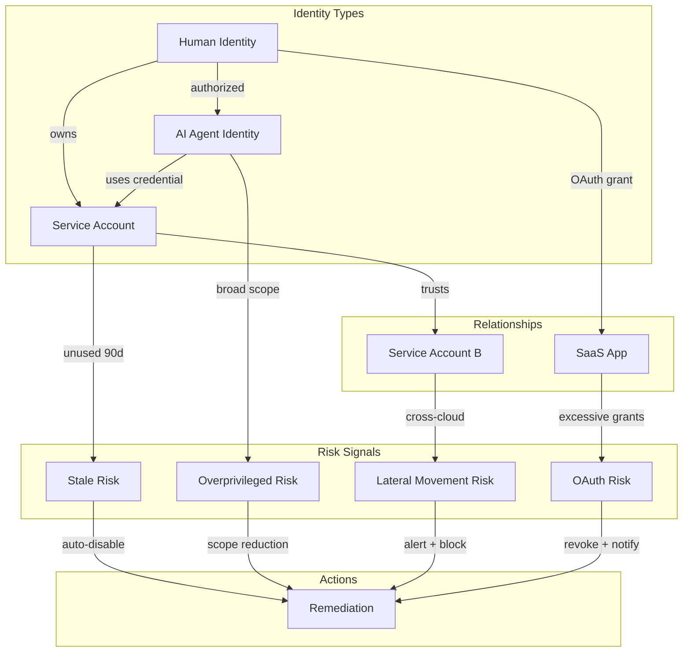
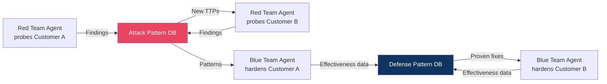
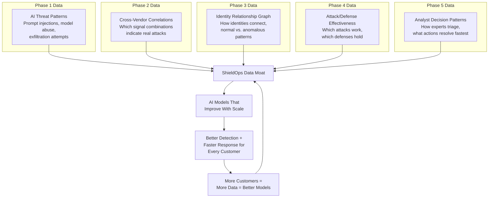
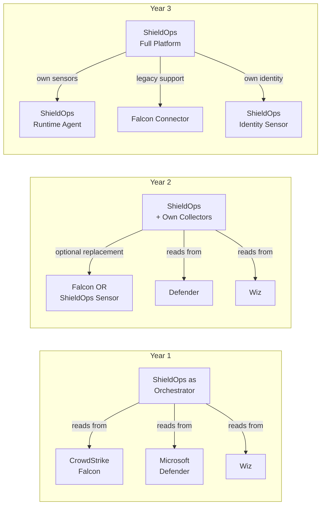
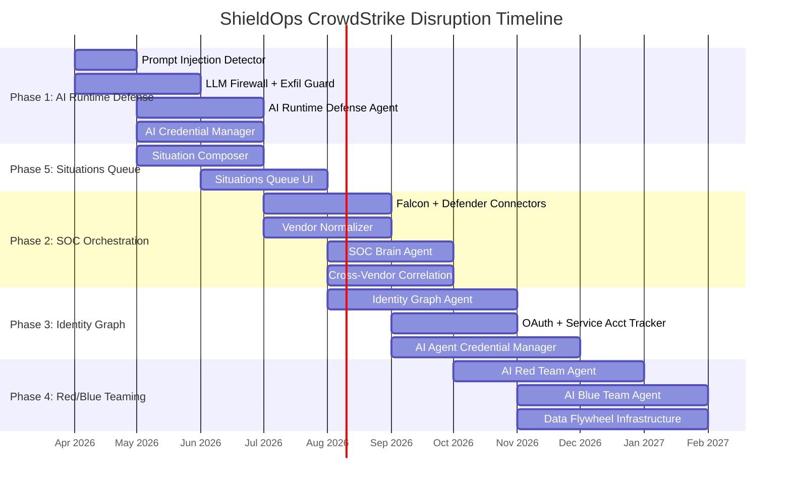

# ShieldOps Strategic Plan: Disrupting CrowdStrike

**Document Classification:** Internal -- Confidential
**Version:** 1.0
**Date:** 2026-03-24
**Authors:** ShieldOps Strategy Team

---

## Executive Summary

CrowdStrike dominates endpoint detection and response (EDR) with a $70B+ market cap built on the Falcon agent. But the security control point is shifting. Enterprises are deploying AI agents, adopting multi-vendor security stacks, and demanding outcomes over dashboards. CrowdStrike's moat -- kernel-level endpoint telemetry -- becomes less relevant when the attack surface moves to identities, AI pipelines, and cross-tool orchestration gaps.

**ShieldOps' thesis:** The next security platform winner will not be another EDR vendor that bolts on AI. It will be an **AI-native SOC brain** that sits above all security tools, orchestrates response across vendors, and treats AI agents themselves as first-class assets to protect.

This plan executes in five phases over 10 months, each designed to be independently valuable while compounding into a defensible platform.

---

## Strategic Overview



---

## Phase 1: AI Runtime Defense

**The Wedge -- Months 1-3**

### Strategic Rationale

CrowdStrike announced "AI Pipeline Defense" at Fal.Con 2025, but it is a bolt-on module retrofitted onto Falcon's endpoint-centric architecture. They lack deep understanding of LLM execution patterns, agent tool-call chains, and prompt injection vectors. ShieldOps, built from day one on LangGraph agent orchestration, has a structural advantage: we already model agent behavior graphs internally.

Every enterprise deploying Anthropic Claude, OpenAI GPT, or internal LLM apps faces a new attack surface with zero coverage from existing EDR. This is our wedge.

### Target Customer

- Enterprises building LLM-powered applications (Anthropic/OpenAI API customers)
- Platform engineering teams deploying AI agents to production
- Security teams asked to "approve" AI deployments with no tooling

### What We Build

| Component | Description | ShieldOps Agent/Module |
|-----------|-------------|----------------------|
| **AI Runtime Defense Agent** | LangGraph agent monitoring AI app execution in real-time | `agents/ai_runtime_defense/` |
| **Prompt Injection Detector** | Detects direct/indirect injection, jailbreaks, prompt leaking | `security/prompt_injection_engine.py` |
| **Model Abuse Detector** | Identifies misuse patterns: data exfiltration via model, excessive tool calls, privilege escalation through agents | `security/model_abuse_engine.py` |
| **AI Exfiltration Guard** | Monitors model outputs for PII, secrets, internal data leakage | `security/ai_exfiltration_engine.py` |
| **AI Supply Chain Scanner** | Scans model registries, prompt templates, RAG data sources for poisoning | `security/ai_supply_chain_engine.py` |
| **LLM Firewall** | Inline proxy that enforces policies on LLM API calls (input/output filtering, rate limiting, cost caps) | `security/llm_firewall_engine.py` |
| **AI Credential Manager** | Short-lived, scoped credentials for AI agent tool access with automatic rotation | `security/ai_credential_engine.py` |

### Architecture



### Go-to-Market

- **Messaging:** "Secure your AI agents before they go to production"
- **Channel:** Anthropic/OpenAI partner ecosystems, AI engineering communities, CISO roundtables on AI risk
- **Revenue model:** Per-protected-AI-app pricing ($500-2,000/app/month based on call volume)
- **Land motion:** Free tier for 1 AI app, upgrade on second app or advanced policies
- **Proof point:** Time from "pip install shieldops" to first blocked prompt injection < 15 minutes

### Why CrowdStrike Cannot Respond Quickly

1. Falcon architecture assumes a kernel sensor on an endpoint -- LLM APIs have no "endpoint"
2. Their AI pipeline defense is a module, not a platform -- bolted onto existing alert workflow
3. They lack internal expertise in agent orchestration (LangGraph, tool-call chains, RAG pipelines)
4. Their sales motion is annual contracts with 12-month cycles -- we offer usage-based instant activation

---

## Phase 2: Cross-Vendor SOC Orchestration

**Brain Above Tools -- Months 3-6**

### Strategic Rationale

Every enterprise runs 40-70 security tools. CrowdStrike wants to be the single pane of glass by replacing other vendors. This fails because: (a) no CISO will rip and replace their entire stack, and (b) CrowdStrike's own modules have gaps (cloud security, identity, data security). The opportunity is to be the **neutral AI control plane** that orchestrates across all vendors -- including Falcon.

### What We Build

| Component | Description |
|-----------|-------------|
| **CrowdStrike Falcon Connector** | Ingest detections, RTR sessions, device inventory, vulnerability data via Falcon API |
| **Microsoft Defender Connector** | Ingest alerts, incidents, threat indicators from M365 Defender / Sentinel |
| **Wiz Connector** | Ingest cloud security findings, attack paths, vulnerability data |
| **Vendor Telemetry Normalizer** | Maps vendor-specific schemas to ShieldOps unified format (OCSF-based) |
| **Cross-Vendor Correlation Engine** | Correlates signals across vendors: Falcon endpoint alert + Defender identity alert + Wiz cloud finding = single situation |
| **SOC Brain Agent** | LangGraph agent that receives correlated situations and decides: auto-remediate, enrich, or escalate |
| **Situation Engine** | Aggregates related alerts into "situations" with full kill-chain context |

### Positioning

```
                    CrowdStrike's Vision          ShieldOps' Vision
                    =====================          ==================
                    Replace all vendors            Orchestrate all vendors
                    with Falcon modules            through AI brain

                    +-----------------+            +------------------+
                    | Falcon Platform |            | ShieldOps Brain  |
                    |  EDR | Cloud |  |            |   AI Orchestrator|
                    |  Identity | XDR |            +--------+---------+
                    +-----------------+                     |
                                                   +-------+--------+
                                                   |       |        |
                                                Falcon  Defender   Wiz
                                                   |       |        |
                                                Endpoints Identity Cloud
```

**Key insight:** By consuming CrowdStrike's own API, we turn Falcon into a data source rather than a platform. The value migrates from individual detections to cross-vendor correlation and AI-driven response.

### Revenue Model

- Platform fee: $5-15/seat/month for SOC orchestration
- Connector marketplace: base connectors free, premium connectors (ServiceNow, Splunk SOAR) paid
- Action credits: usage-based pricing for automated remediations executed

---

## Phase 3: Identity & AI Agent Security Graph

**The New Endpoint -- Months 4-8**

### Strategic Rationale

CrowdStrike's identity module (acquired via Preempt) focuses on Active Directory and basic identity threats. But the real identity attack surface in 2026 is:

- **OAuth grants** that accumulate over years and nobody audits
- **Service accounts** with admin privileges and no MFA
- **AI agent identities** with broad API access and no human oversight
- **Cross-cloud IAM** where a compromised GCP service account pivots to AWS

Identities (human + machine + AI agent) are the new endpoint. Lateral movement happens through OAuth grants and service account abuse, not just SMB and RDP.

### What We Build

| Component | Description |
|-----------|-------------|
| **Identity Graph Agent** | Continuously maps all identities (human, service account, AI agent) and their relationships, permissions, and access patterns |
| **OAuth Grant Analyzer** | Discovers all OAuth grants across SaaS apps, flags overprivileged, stale, or suspicious grants |
| **Service Account Tracker** | Inventories service accounts, monitors usage patterns, detects credential sharing |
| **AI Agent Credential Manager** | Issues short-lived, scoped credentials for AI agents with automatic rotation and usage logging |
| **Identity Risk Engine** | Calculates composite risk score per identity based on permissions, behavior, relationships |
| **Lateral Movement Detector** | Detects identity-based lateral movement: OAuth token reuse, service account pivoting, cross-cloud privilege escalation |
| **Trust Relationship Engine** | Maps and monitors trust relationships (federation, delegation, cross-account roles) |

### Identity Graph Data Model



### Why This Is a Blind Spot

| Dimension | CrowdStrike | ShieldOps |
|-----------|-------------|-----------|
| Identity types covered | Human (AD/Entra ID) | Human + Service Account + AI Agent |
| OAuth grant visibility | None | Full discovery + risk scoring |
| AI agent credentials | None | Short-lived scoped issuance |
| Cross-cloud identity | Limited (Falcon for Cloud) | Unified graph (AWS IAM + GCP IAM + Azure AD + K8s RBAC) |
| Lateral movement detection | Network-based (endpoint telemetry) | Identity-graph-based (OAuth, federation, delegation) |

---

## Phase 4: Continuous AI Red/Blue Teaming

**Self-Improving Defense -- Months 6-10**

### Strategic Rationale

Penetration testing is a point-in-time exercise. Red team engagements happen annually. Threat landscapes change daily. The opportunity is **continuous, AI-driven adversarial validation** where:

1. An AI Red Team agent continuously probes customer environments using latest TTPs
2. An AI Blue Team agent automatically hardens defenses based on findings
3. Every engagement across every customer improves the models for all customers (data flywheel)

This turns ShieldOps from a detection product into a **data engine** that compounds in value.

### What We Build

| Component | Description |
|-----------|-------------|
| **AI Red Team Agent** | Autonomous agent that continuously probes customer environments: credential testing, misconfiguration exploitation, AI pipeline attacks, identity-based lateral movement |
| **AI Blue Team Agent** | Receives red team findings, automatically generates and applies hardening measures: policy tightening, credential rotation, configuration fixes |
| **Attack Simulation Engine** | Library of attack scenarios mapped to MITRE ATT&CK + AI-specific TTPs, continuously updated |
| **Defense Hardening Engine** | Automated generation of remediation playbooks from red team findings |
| **Adversarial Validation Engine** | Validates that blue team fixes actually block red team attacks (closed-loop verification) |

### The Data Flywheel



**Key dynamic:** Customer N+1 gets the benefit of all attacks and defenses discovered across customers 1 through N. This is a network effect that CrowdStrike's endpoint telemetry cannot replicate in the AI/identity domain.

### Safety Guardrails

Red/blue teaming in production requires strict safety controls:

- **Blast radius limits:** Red team operates in read-only mode by default; write operations require explicit customer opt-in per scope
- **OPA policy enforcement:** Every red team action passes through ShieldOps policy engine before execution
- **Customer isolation:** Attack patterns are anonymized before entering shared database; no customer data crosses boundaries
- **Kill switch:** Customer can disable red team agent instantly via API or dashboard
- **Confidence thresholds:** Autonomous action > 0.85 confidence; human approval for 0.5-0.85; escalation < 0.5

---

## Phase 5: Outcome-Centric UX -- Situations Queue

**Differentiated Buyer Experience -- Months 2-4**

### Strategic Rationale

CrowdStrike's Falcon console is powerful but complex. It is built for dedicated SOC analysts who spend 8 hours a day in the tool. But the fastest-growing market segment is companies with 500-5,000 employees that have a security team of 2-5 people. These teams cannot operate a 20-widget dashboard. They need **an MDR-analyst-like experience** without the MDR price tag.

CrowdStrike cannot simplify their UX without breaking backward compatibility for their 29,000+ enterprise customers. We optimize from day one.

### What We Build

| Component | Description |
|-----------|-------------|
| **Situations Queue** | Single prioritized list of "situations" replacing traditional alert dashboards |
| **Situation Composer** | AI agent that aggregates related alerts, enriches with context, and presents end-to-end narrative |
| **Action Recommender** | Each situation comes with 1-2 recommended actions (auto-remediate or approve) |
| **MTTD/MTTR Tracker** | Measures mean-time-to-detect and mean-time-to-respond with minimal human clicks |
| **Outcome Dashboard** | Shows "incidents handled", "MTTR reduction", "AI actions taken" -- not "alerts generated" |

### UX Comparison

```
CrowdStrike Falcon Console              ShieldOps Situations Queue
============================             ============================

+--+--+--+--+--+                         +----------------------------+
|  |  |  |  |  |  20 widgets             | Situation #1 (Critical)    |
+--+--+--+--+--+                         | Lateral movement detected  |
|  |  |  |  |  |  100+ alert types       | via OAuth token reuse      |
+--+--+--+--+--+                         | across AWS + Azure         |
|  |  |  |  |  |  Requires analyst       |                            |
+--+--+--+--+--+  expertise              | [Auto-Remediate] [Review]  |
                                          +----------------------------+
Result: Alert fatigue,                    | Situation #2 (High)        |
        high MTTR,                        | Prompt injection attempt   |
        missed connections                | on production RAG pipeline |
                                          |                            |
                                          | [Already Blocked] [Detail] |
                                          +----------------------------+

                                          Result: Zero alert fatigue,
                                                  sub-minute MTTR,
                                                  full context per item
```

### Success Metrics

| Metric | Target | Measurement |
|--------|--------|-------------|
| MTTD (mean time to detect) | < 5 minutes | Time from first signal to situation creation |
| MTTR (mean time to respond) | < 15 minutes | Time from situation creation to resolution |
| Human clicks per incident | < 3 | Clicks required to resolve a situation |
| Alert-to-situation ratio | 50:1 | Number of raw alerts per curated situation |
| Auto-resolution rate | > 60% | Situations resolved without human intervention |

---

## Data Moat Strategy

Each phase contributes to a compounding data advantage that becomes harder to replicate over time.



| Phase | Data Asset | Defensibility |
|-------|-----------|---------------|
| Phase 1 | AI threat pattern database (prompt injections, model abuse TTPs) | First-mover in AI runtime telemetry; patterns unique to LLM execution |
| Phase 2 | Cross-vendor correlation rules (which multi-tool signal combinations indicate real attacks) | Requires integration with 10+ vendors; each integration adds correlation value |
| Phase 3 | Identity relationship graph (how identities connect across cloud + SaaS + AI) | Graph density increases with customer count; cold-start problem for competitors |
| Phase 4 | Attack/defense effectiveness matrix (which attacks work, which defenses hold) | Requires active red/blue teaming at scale; compounds with every engagement |
| Phase 5 | Analyst decision corpus (how experts triage, what actions resolve fastest) | Behavioral data from real SOC workflows; trains better AI recommendations |

**Key insight:** CrowdStrike's data moat is endpoint telemetry (billions of events from millions of sensors). Our data moat is **decision telemetry** -- how AI and humans make security decisions across tools, identities, and AI systems. These are complementary, not competitive, which is why Phase 2 consumes Falcon data rather than replacing it.

---

## Pricing & Go-to-Market

### Pricing Philosophy

CrowdStrike charges per-module, per-endpoint, with annual commitments. This creates:
- Shelf-ware (modules purchased but not deployed)
- Unpredictable costs (endpoint count fluctuates)
- Lock-in (annual contracts with 3-year ramps)

ShieldOps uses **outcome-based, usage-driven pricing** aligned with customer value.

### Pricing Model

| Tier | Target | Pricing | Includes |
|------|--------|---------|----------|
| **Starter** | Teams building AI apps | $500/AI app/month | AI Runtime Defense, LLM Firewall, Situations Queue |
| **Professional** | Security teams (5-20 people) | $12/seat/month + $0.50/situation handled | Cross-Vendor SOC, Identity Graph, Situations Queue |
| **Enterprise** | SOC teams (20+) | Custom | All phases + Continuous Red/Blue + Dedicated CSM |
| **Usage Add-ons** | All tiers | Per-action pricing | Automated remediations ($2/action), Red team simulations ($50/campaign) |

### Pricing Comparison

| Dimension | CrowdStrike | ShieldOps |
|-----------|-------------|-----------|
| Unit of billing | Per endpoint, per module | Per outcome (situations handled, AI apps protected) |
| Contract length | Annual (often 3-year) | Monthly or annual |
| Module complexity | 20+ modules to understand | 3 tiers, usage-based add-ons |
| Free tier | None | 1 AI app, 100 situations/month |
| Cost predictability | Low (endpoint count varies) | High (usage-based with caps) |
| Time to value | Weeks (deployment + tuning) | Minutes (API integration) |

### GTM Motion

```
Month 1-3:   Product-led growth via AI Runtime Defense
             - Developer docs, pip install, free tier
             - Anthropic/OpenAI ecosystem partnerships
             - Content: "How to secure your AI agents" series

Month 3-6:   Sales-assisted for SOC Orchestration
             - Target CrowdStrike customers frustrated with alert volume
             - "Works WITH Falcon" positioning (not replace)
             - POC: connect 3 tools in 1 hour, show correlated situations

Month 6-10:  Enterprise sales for full platform
             - Red/Blue teaming as premium differentiator
             - Identity Graph as expansion from SOC orchestration
             - Reference customers from Phase 1-2
```

---

## Integration Strategy

### Principle: Consume First, Compete Later

We deliberately use CrowdStrike, Defender, and Wiz APIs as data sources. This is strategic:

1. **Reduces friction:** Customer does not need to rip and replace anything
2. **Proves value faster:** Correlate existing tools before asking customer to adopt new ones
3. **Builds dependency:** Once ShieldOps is the orchestration layer, individual tools become interchangeable
4. **Avoids direct competition:** "We make your Falcon investment more valuable" vs "Replace Falcon"

### Integration Roadmap

| Quarter | Integrations | Purpose |
|---------|-------------|---------|
| Q1 | CrowdStrike Falcon, Microsoft Defender, Wiz | Core EDR + Cloud security data sources |
| Q2 | SentinelOne, Palo Alto Cortex, Okta, AWS Security Hub | Expand vendor coverage, identity data |
| Q3 | ServiceNow, Jira, Slack, PagerDuty | Workflow + ChatOps integration |
| Q4 | Splunk, Elastic, Snowflake | SIEM data lake integration |

### Migration Path (Long-term)



Year 1: Pure orchestrator (no own sensors). Year 2: Optional lightweight collectors for AI runtime and identity. Year 3: Full platform with own sensors, legacy vendor support retained.

---

## Market Positioning

### Positioning Statement

> ShieldOps is the **neutral AI security control plane** for enterprises running multi-vendor security stacks. We sit above your existing tools -- CrowdStrike, Defender, Wiz -- correlate signals across all of them, and use AI agents to investigate, decide, and act. We are not another EDR with LLMs bolted on. We are the brain that makes every security tool you already own work better together.

### Positioning Map

```
                    AI-Native Architecture
                           ^
                           |
              ShieldOps    |
                 *         |
                           |
    Multi-Vendor --------- + --------- Single-Vendor
    Orchestrator           |            Platform
                           |
                           |    CrowdStrike
                           |        *
                           |
                    Legacy Architecture

    Palo Alto *                    Microsoft *
    (Cortex XSIAM)                (Defender XDR)
```

### Messaging Framework

| Audience | Message |
|----------|---------|
| **CISO** | "Reduce MTTR by 80% without ripping out your existing stack. ShieldOps orchestrates your security tools with AI." |
| **SOC Manager** | "Your team handles 3x the incidents with zero new headcount. AI situations replace alert fatigue." |
| **Security Engineer** | "Connect CrowdStrike + Defender + Wiz in 1 hour. See your first correlated situation in 5 minutes." |
| **AI/Platform Engineer** | "Secure your AI agents in production. Prompt injection detection, credential scoping, exfiltration prevention." |
| **CFO** | "Pay per incident handled, not per endpoint counted. Predictable costs, measurable outcomes." |

---

## Competitive Differentiation

### Feature Comparison Matrix

| Capability | ShieldOps | CrowdStrike Falcon | Palo Alto Cortex XSIAM | Microsoft Defender XDR |
|-----------|-----------|-------------------|----------------------|---------------------|
| **Architecture** | AI-native, agent-based (LangGraph) | Kernel sensor + cloud backend | SIEM + SOAR + XDR hybrid | M365 ecosystem-integrated |
| **AI Runtime Protection** | Purpose-built (prompt injection, model abuse, exfiltration) | Bolt-on module (new) | Limited | Limited |
| **Multi-Vendor Orchestration** | Core value prop -- works with any vendor | Falcon-centric (replaces other vendors) | Ingests third-party, Palo Alto-centric actions | Microsoft-centric |
| **Identity Coverage** | Human + Service Account + AI Agent | Human (AD/Entra ID via Preempt) | Human (UEBA) | Human (Entra ID native) |
| **AI Agent Credentials** | Short-lived, scoped, auto-rotating | None | None | None |
| **Cross-Cloud Identity Graph** | AWS + GCP + Azure + K8s + SaaS unified | Limited (Falcon for Cloud) | Partial (Prisma Cloud) | Azure-centric |
| **Continuous Red/Blue Teaming** | AI-driven, continuous, cross-customer learning | Manual services (Falcon OverWatch) | Limited (Unit 42 services) | None native |
| **UX Model** | AI-curated situations queue | Widget dashboard (powerful but complex) | Unified dashboard (complex) | Microsoft portal (familiar but siloed) |
| **Pricing Model** | Usage-based (outcomes) | Per-endpoint, per-module (annual) | Per-GB ingestion (expensive at scale) | Per-user (Microsoft licensing) |
| **Time to Value** | Minutes (API integration) | Weeks (agent deployment) | Weeks-months (data onboarding) | Days (if already M365) |
| **Deployment** | SaaS + hybrid (no endpoint agent required) | Requires kernel agent on every endpoint | Requires log forwarding + configuration | Requires M365/Azure ecosystem |
| **Data Moat** | Decision telemetry (how AI + humans resolve incidents) | Endpoint telemetry (billions of kernel events) | Log telemetry (SIEM data) | M365 ecosystem telemetry |
| **Open Standards** | OCSF, OpenTelemetry native | Proprietary (CrowdStrike Event Stream) | Proprietary + some OCSF | Proprietary (Microsoft Graph) |
| **Autonomous Action** | OPA-governed, confidence-based (>0.85 auto, <0.5 escalate) | Charlotte AI (new, limited autonomy) | XSOAR playbooks (rule-based) | Copilot for Security (advisory only) |

### Where We Win vs. Each Competitor

**vs. CrowdStrike:**
- AI runtime defense (they have no native LLM/agent protection)
- Multi-vendor orchestration (they want to replace vendors, we orchestrate them)
- Identity coverage breadth (service accounts, AI agents, OAuth grants)
- Usage-based pricing vs. module complexity
- Time to value: minutes vs. weeks

**vs. Palo Alto XSIAM:**
- AI-native architecture vs. SIEM-evolved platform
- No data ingestion costs (we connect to existing tools, not re-ingest data)
- Purpose-built AI defense vs. generic ML anomaly detection
- Simpler pricing (outcomes vs. GB/day)

**vs. Microsoft Defender XDR:**
- Vendor-neutral (works across AWS, GCP, non-Microsoft stacks)
- AI agent security (Microsoft has no AI runtime protection)
- Continuous red/blue teaming (Microsoft has no equivalent)
- Better for multi-cloud (Microsoft is Azure-centric)

---

## Implementation Alignment with ShieldOps Codebase

The following maps each phase to existing ShieldOps infrastructure.

| Phase | Existing Infrastructure | New Development |
|-------|------------------------|-----------------|
| Phase 1 | `security/` engines, OPA policy framework, `agents/security/` | AI runtime defense agent, LLM firewall, prompt injection detector |
| Phase 2 | `connectors/` (AWS, GCP, Azure, K8s), `agents/soar_orchestration/`, `agents/xdr/` | Falcon/Defender/Wiz connectors, SOC brain agent, vendor normalizer |
| Phase 3 | `security/` identity engines, `agents/itdr/`, `agents/zero_trust/` | Identity graph agent, OAuth analyzer, AI credential manager |
| Phase 4 | `agents/security_testing/`, `agents/threat_modeling/`, `agents/detection_engineering/` | AI red/blue team agents, attack simulation engine, adversarial validation |
| Phase 5 | `dashboard-ui/`, `agents/soc_analyst/`, `incidents/` engines | Situations queue UI, situation composer, MTTD/MTTR tracker |

### Existing Agent Leverage

- **50 LangGraph agents** already built -- new agents follow established patterns
- **1,562+ engine modules** with standardized interfaces (add_record, process, generate_report)
- **OPA policy framework** for governing autonomous actions
- **Multi-cloud connectors** with real SDK implementations
- **14 API middleware modules** (rate limiter, tenant isolation, billing enforcement)
- **React + TypeScript dashboard** ready for Situations Queue UI

---

## Risk Assessment

| Risk | Likelihood | Impact | Mitigation |
|------|-----------|--------|------------|
| CrowdStrike acquires an AI security startup | High | Medium | Move fast on Phase 1; our LangGraph architecture is hard to replicate via acquisition |
| Enterprises unwilling to give orchestrator write access | Medium | High | Start read-only (Phase 2), earn trust, expand to write (Phase 4) |
| AI threat landscape evolves faster than our detectors | Medium | Medium | Data flywheel (Phase 4) ensures continuous improvement; open threat intel feeds |
| CrowdStrike offers "works with" partner program | Medium | Low | We join it -- our strategy works WITH Falcon, not against it |
| Pricing pressure from Microsoft bundling | High | Medium | Target multi-cloud customers where Microsoft bundling does not apply |
| Regulatory constraints on AI red teaming | Low | High | OPA policy enforcement, customer-controlled scope, compliance certifications |

---

## Timeline Summary



---

## Success Criteria

| Milestone | Target Date | Metric |
|-----------|------------|--------|
| Phase 1 GA | Month 3 | 50 AI apps protected, 10 paying customers |
| Phase 2 GA | Month 6 | 100 cross-vendor correlations/day, 25 paying customers |
| Phase 3 GA | Month 8 | 10,000 identities in graph, 5 enterprise customers |
| Phase 4 GA | Month 10 | 500 red team campaigns, measurable defense improvement |
| Phase 5 GA | Month 4 | MTTR < 15 min, > 60% auto-resolution rate |
| ARR Target | Month 12 | $2M ARR |
| Data Moat | Month 12 | Cross-customer learning demonstrably improves detection by 20%+ |

---

## Conclusion

CrowdStrike built a $70B company by owning the endpoint. But endpoints are no longer the primary attack surface. AI pipelines, multi-vendor tool sprawl, identity graphs, and autonomous AI agents represent the new frontier of enterprise security.

ShieldOps does not try to out-EDR CrowdStrike. Instead, we shift the control point from the endpoint to the **AI-native SOC brain** -- an orchestration layer that makes every security tool (including Falcon) work better, protects the AI systems that CrowdStrike cannot see, and delivers outcomes instead of dashboards.

The wedge is AI runtime defense (Phase 1) -- a category CrowdStrike is structurally unable to lead. The endgame is the neutral AI security control plane (Phase 2-5) that makes individual point tools interchangeable beneath an intelligent orchestration layer.

We are not building a better mousetrap. We are making the mouse irrelevant.

---

*ShieldOps -- The AI-Native SOC Brain*
*Internal Strategy Document -- Do Not Distribute*
